# 🏎️ DriveAnalyzer

<div align="center">

[](https://expo.dev/)
[](https://reactnative.dev/)
[](https://github.com/pmndrs/zustand)
[](https://www.sqlite.org/)
[](LICENSE)
[](#)

</div>

---

**DriveAnalyzer** is a mobile application that monitors and logs driving safety in real-time. By processing motion telemetry directly from your phone's built-in sensors, the app evaluates driving habits, records safety events (like sudden braking, aggressive swerves, or phone distraction), and scores each trip out of 100. It features a responsive, cyberpunk-inspired HUD interface and saves all trip data locally using SQLite.

---

## 📋 Table of Contents
1. [Project Overview](#-project-overview)
2. [Tech Stack Used](#-tech-stack-used)
3. [Sensors Used](#-sensors-used)
4. [Event Detection Strategy](#-event-detection-strategy)
5. [Threshold Values Chosen](#-threshold-values-chosen)
6. [Driving Score Calculation Logic](#-driving-score-calculation-logic)
7. [How to Run Locally](#-how-to-run-locally)
8. [Screenshots & Visual Demos](#-screenshots--visual-demos)
9. [Database Schema](#-database-schema)
10. [Appendix: Raw Telemetry Payload Reference](#-appendix-raw-telemetry-payload-reference)

---

## 🔍 Project Overview

DriveAnalyzer acts as a local telemetry logger for your vehicle. The monitoring engine kicks in as soon as you tap the ignition button, streaming sensor data to trace your motion profile. 

During the trip, the app processes raw sensor inputs through a local rule engine to detect safety incidents. These incidents trigger visual HUD alerts and deduct points from your session score. When you stop the engine, session summaries and event lists are persistently stored in a local SQLite database, populating your analytics dashboard with historical trip metrics.

---

## 💻 Tech Stack Used

*   **Framework**: [React Native](https://reactnative.dev/) with [Expo (v55.0.0)](https://expo.dev/)
*   **Navigation**: [Expo Router](https://docs.expo.dev/router/introduction/) (File-based routing, native navigation)
*   **State Management**: [Zustand](https://github.com/pmndrs/zustand) (Super-fast, hook-based global state engine)
*   **Database**: [expo-sqlite](https://docs.expo.dev/versions/v55.0.0/sdk/sqlite/) (Embedded persistent local database)
*   **Telemetry Visualizations**: [react-native-gifted-charts](https://github.com/Abhinandan-Kushwaha/react-native-gifted-charts) (SVG charts for session diagnostics)
*   **Styling & Theme**: React Native StyleSheet, utilizing a neon Cyberpunk aesthetic with customizable linear gradients and glassmorphism styling
*   **Sensors Integration**: [expo-sensors](https://docs.expo.dev/versions/v55.0.0/sdk/sensors/) (DeviceMotion telemetry)

---

## 📡 Sensors Used

DriveAnalyzer taps into the smartphone's built-in inertial measurement unit (IMU) using **Expo DeviceMotion**:

1.  **Three-Axis Accelerometer ($a_x, a_y, a_z$)**:
    *   Measures instantaneous acceleration forces applied to the device in meters per second squared ($\text{m/s}^2$).
    *   Used to calculate deceleration (braking force), acceleration magnitude, and sudden shock vectors.
2.  **Three-Axis Gyroscope / Rotation Rate ($\alpha, \beta, \gamma$)**:
    *   Measures the rate of rotation around the device's local axes in radians per second ($\text{rad/s}$).
    *   Used to capture steering maneuvers, lateral cornering velocity, and device handling/rotation rates.

*Note: Telemetry queries are pooled at a frequency of **$10\text{Hz}$** ($100\text{ms}$ intervals) to optimize battery life while maintaining reliable telemetry precision.*

---

## 🧠 Event Detection Strategy

DriveAnalyzer employs a **Windowed Buffer Analysis Strategy**:

```
[Device Motion API] ────> [EMA Noise Filter] ────> [50-Frame Sliding Buffer]
                                                             │
                                                             ▼
                                                    [Engine Rules Engine]
                                                             │
                                      ┌──────────────────────┼──────────────────────┐
                                      ▼                      ▼                      ▼
                              [Harsh Acceleration]    [Harsh Braking]       [Phone Handling]
```

1.  **Exponential Moving Average (EMA) Filtering**:
    Raw sensor readings contain high-frequency noise from road imperfections and engine vibrations. The app passes inputs through an EMA filter before buffering:
    $$\text{EMA}_{\text{current}} = \alpha \cdot \text{Val}_{\text{current}} + (1 - \alpha) \cdot \text{EMA}_{\text{prev}}$$
    *   **Accelerometer Filter**: $\alpha = 0.20$ (High noise suppression)
    *   **Gyroscope Filter**: $\alpha = 0.25$ (Balances reaction speed and noise cancellation)
2.  **Sliding Telemetry Buffer**:
    The store maintains a sliding queue of the latest $50$ filtered frames ($5$ seconds of telemetry). 
3.  **Frame-Based Event Rules**:
    For each sensor tick, the engine scans the trailing sliding window ($20$, $30$, or $40$ frames depending on the event type). An event triggers only when sensor thresholds are breached consecutively across the required frame window, preventing false-positive spikes.

---

## 📐 Threshold Values Chosen

The following calibrated thresholds are checked against the processed buffer:

| Event Identifier | Parameter & Condition | Required Duration | Rationale |
| :--- | :--- | :--- | :--- |
| **Harsh Braking** | Forward acceleration $a_y < -3.0\,\text{m/s}^2$<br>Rotation Rate $\beta < 0.4\,\text{rad/s}$ | $\ge 2.0\text{s}$ ($20$ frames) | Decelerating abruptly forward while maintaining a straight line (low yaw rate). |
| **Harsh Acceleration**| Acceleration magnitude $\|a\| > 5.0\,\text{m/s}^2$ | $\ge 0.5\text{s}$ ($\ge 5$ frames in a $20$-frame window) | Rapid acceleration exceeding standard speed adjustments. |
| **Sharp Turn** | Roll rate $\gamma \ge 4.0\,\text{rad/s}$ | $\ge 3.0\text{s}$ ($30$ frames) | High-speed rotation around the z-axis, indicating sharp curves. |
| **Aggressive Steering**| Roll rate $\gamma \ge 4.0\,\text{rad/s}$ | $\ge 3.0\text{s}$ ($30$ frames) | Quick, violent swerves or sudden lanes changes. |
| **Excessive Movement** | $a_{x,y,z} \ge 4.0\,\text{m/s}^2$<br>$\alpha,\beta,\gamma \ge 3.0\,\text{rad/s}$ | $\ge 4.0\text{s}$ ($40$ frames) | High-G motion on all axes simultaneously, suggesting an unstable phone mount. |
| **Phone Use** | $a_{x,y,z} \ge 4.0\,\text{m/s}^2$<br>$\alpha,\beta,\gamma \ge 3.0\,\text{rad/s}$ | $\ge 4.0\text{s}$ ($40$ frames) | Heavy rotation and multi-axis movement indicating manual phone operations while moving. |

---

## 📈 Driving Score Calculation Logic

*   **Starting Baseline**: Every driving session initializes with a perfect safety score of **$100$**.
*   **Real-Time Penalty Deductions**: 
    As anomalies are detected during the session, points are deducted dynamically:
    *   🚭 **Phone Use During Driving**: **$-10$ points** *(Critical Safety Hazard)*
    *   🔄 **Aggressive Steering Movement**: **$-6$ points** *(High Loss of Control risk)*
    *   🛑 **Harsh Braking**: **$-5$ points** *(Tailgating/Distraction indicator)*
    *   ⚡ **Harsh Acceleration**: **$-5$ points** *(Aggressive/Eco-unfriendly driving)*
    *   🔀 **Sharp Turn**: **$-4$ points** *(High lateral acceleration force)*
    *   📱 **Excessive Device Movement**: **$-3$ points** *(Unsecured device distraction)*
*   **Lower Bound**: The score is mathematically capped at a minimum of **$0$** (cannot go negative).
*   **Persistence**: Once the engine session is deactivated, the final score is stored alongside the session ID in the local SQLite table.

---

## 🏃 How to Run Locally

### 📋 Prerequisites
Ensure you have **Node.js** (v18 or higher) and **pnpm** installed:
```bash
npm install -g pnpm
```

### ⚙️ Step-by-Step Execution

1.  **Clone & Install Dependencies**:
    ```bash
    cd DriveAnalyzer1
    pnpm install
    ```

2.  **Start Dev Server**:
    Launch Expo with a cleared developer cache:
    ```bash
    pnpm start --clear
    ```

3.  **Run on Emulators / Physical Devices**:
    *   Press **`a`** for Android Emulator.
    *   Press **`i`** for iOS Simulator.
    *   Press **`w`** for Web preview.
    *   Or scan the QR code using the **Expo Go** application on your physical iOS/Android device.

---

## 📸 Screenshots & Visual Demos

### 📱 User Interface Gallery

#### 🚀 Boot & Splash Screen
<p align="center">
  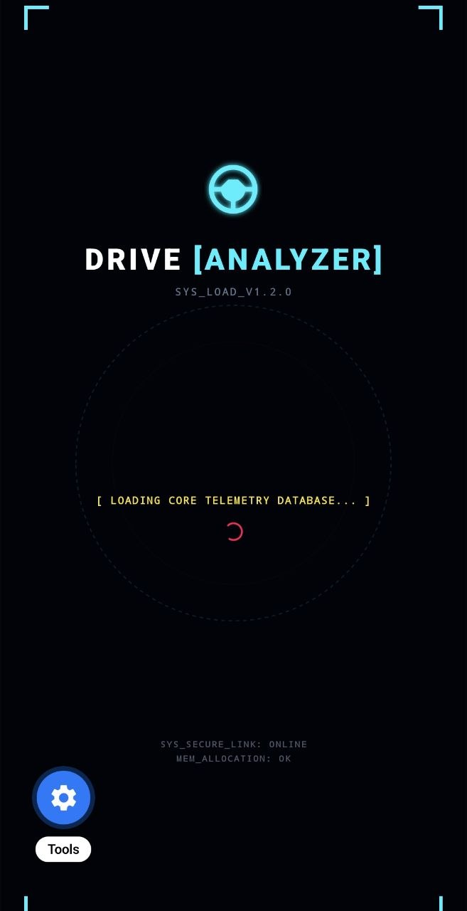
</p>

#### 🔋 Active Reactor HUD (Live Telemetry & Controls)
<p align="center">
  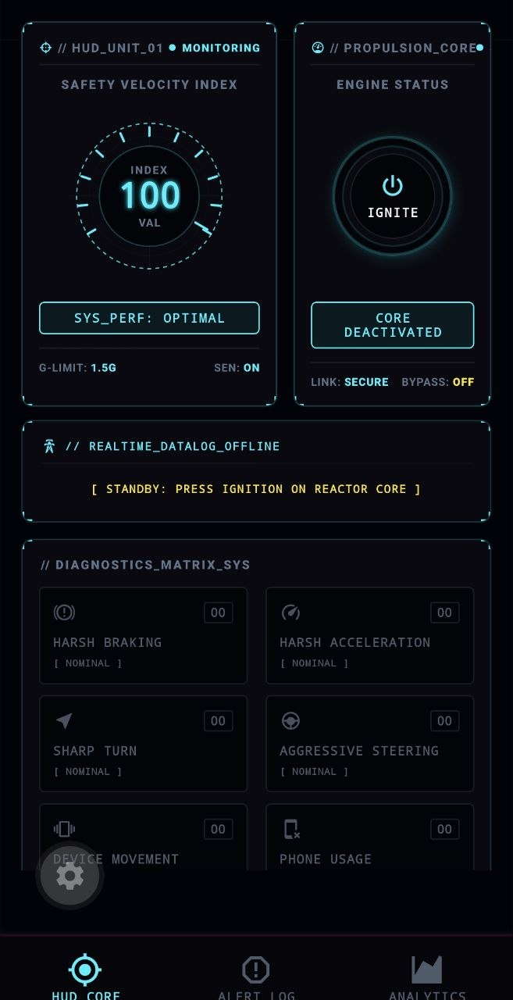&nbsp;&nbsp;
  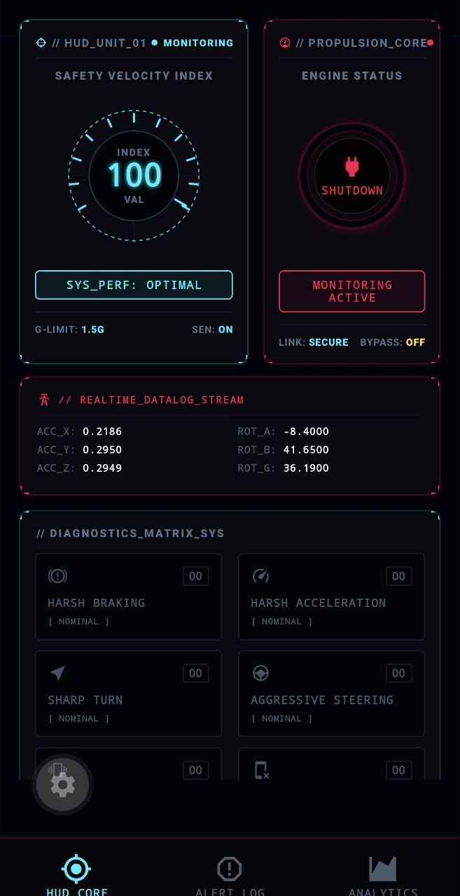&nbsp;&nbsp;
  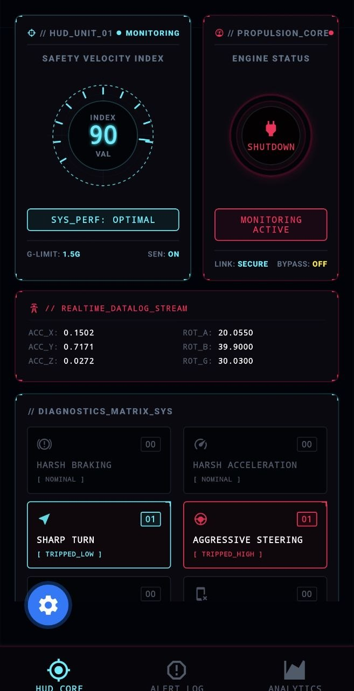&nbsp;&nbsp;
  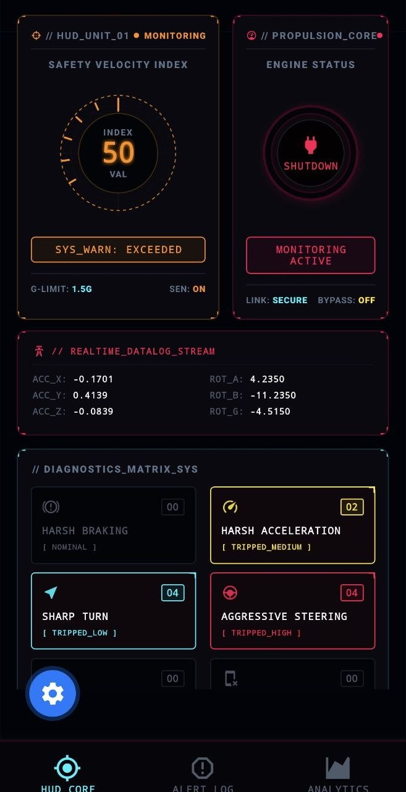
</p>
<p align="center"><i>From left to right: Standby Reactor Core, Active Ignition, Live Telemetry Stream, and Real-Time Event Logs</i></p>

#### 📊 Analytics & Diagnostics Dashboard (Charts)
<p align="center">
  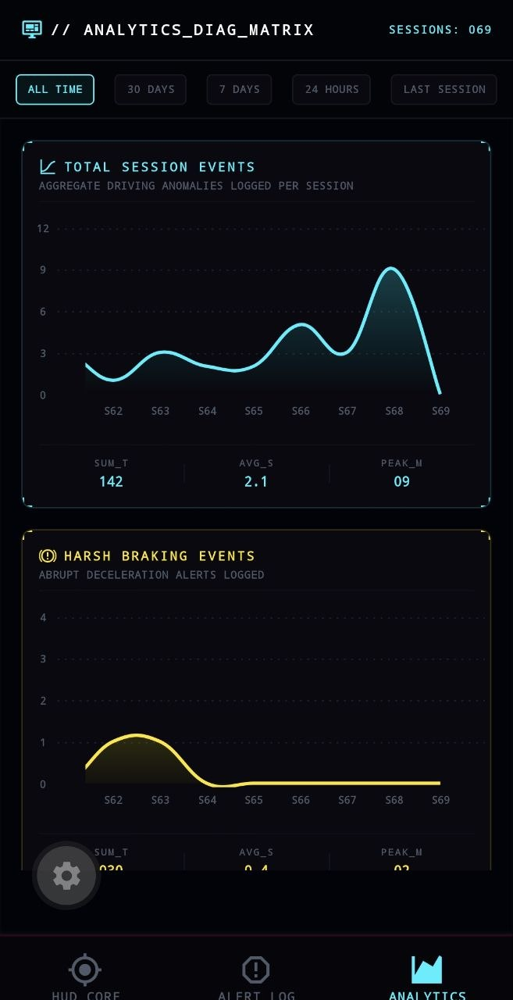&nbsp;&nbsp;
  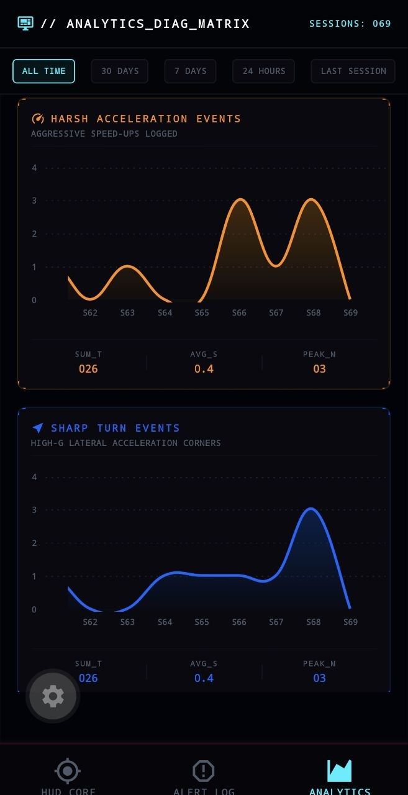&nbsp;&nbsp;
  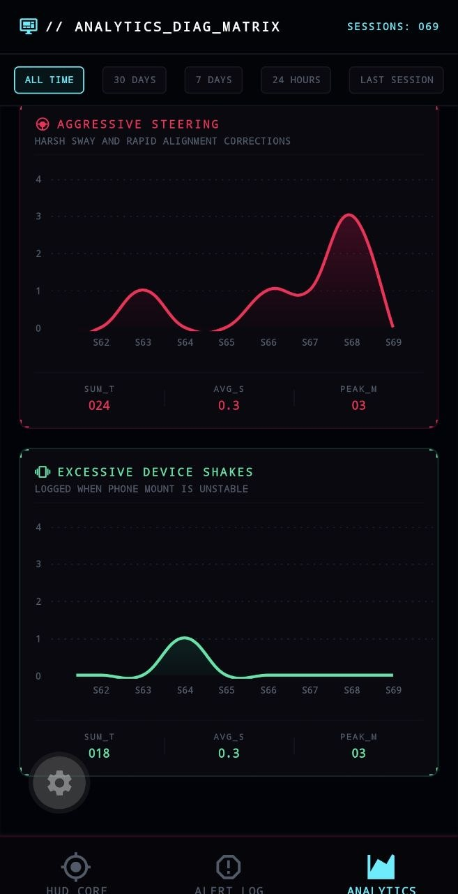
</p>
<br>
<p align="center">
  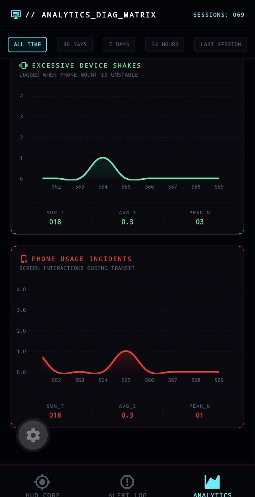&nbsp;&nbsp;
  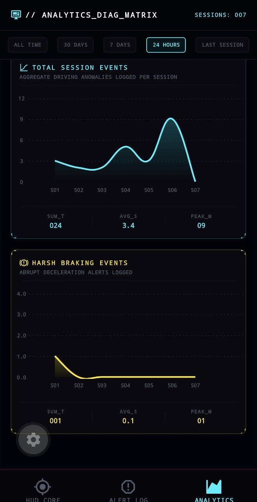&nbsp;&nbsp;
  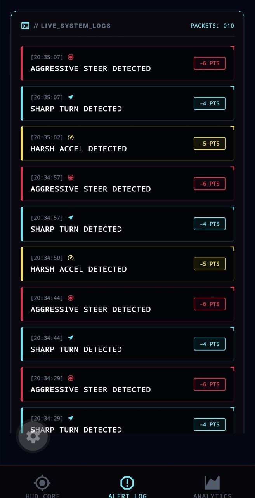
</p>
<p align="center"><i>Driving Event Trends, Specific Event Graphs, and the Real-time Event Log screen</i></p>

---
## Video

https://github.com/user-attachments/assets/985bba1b-65ae-4ef8-86be-58edd16ee989


---

## 🗃️ Database Schema

DriveAnalyzer maps telemetry details inside local storage using two relational tables:

```
┌────────────────────────┐         ┌────────────────────────┐
│        SESSIONS        │         │         EVENTS         │
├────────────────────────┤         ├────────────────────────┤
│ id (PK)      : INTEGER │◄───────┐│ id (PK)      : INTEGER │
│ start_time   : INTEGER │        └│ session_id   : INTEGER │
│ end_time     : INTEGER │         │ event_type   : TEXT    │
│ score        : INTEGER │         │ timestamp    : INTEGER │
└────────────────────────┘         │ score_impact : INTEGER │
                                   └────────────────────────┘
```

---

## 📊 Appendix: Raw Telemetry Payload Reference

Here is a sample sensor telemetry packet sent from the DeviceMotion listener to the state management buffer:

```json
{
   "acceleration": {
      "timestamp": 2130695.110478945,
      "x": -0.04976630210876465,
      "y": 0.2292637825012207,
      "z": 0.023405075073242188
   },
   "accelerationIncludingGravity": {
      "timestamp": 2130695.112477617,
      "x": -1.0524249076843262,
      "y": -5.385718822479248,
      "z": -7.925881385803223
   },
   "interval": 100,
   "orientation": 0,
   "rotation": {
      "alpha": -0.32419317960739136,
      "beta": 0.6108274459838867,
      "gamma": -0.1248379796743393,
      "timestamp": 2130695.110478945
   },
   "rotationRate": {
      "alpha": -0.31500002279371,
      "beta": 0.9800000244250723,
      "gamma": -0.035000000395887826,
      "timestamp": 2130695.112477617
   }
}
```
